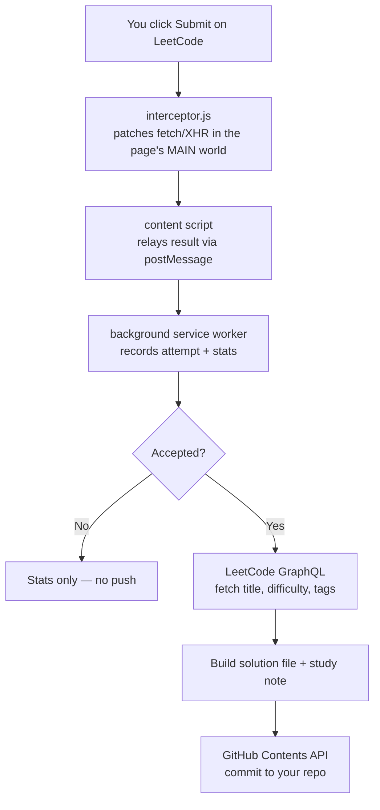

# NeetSync ⇆

**Auto-sync your accepted LeetCode solutions to GitHub — the moment you hit Submit.**

Every accepted submission is automatically committed to your GitHub repo as a
study-ready note: your solution code, plus a README with the problem's
difficulty, topic tags, your honest attempt count, runtime/memory stats, and
space for your own notes and complexity analysis.

<!-- DEMO GIF GOES HERE:

-->

## Why

LeetCode solutions live trapped inside LeetCode. Saving them somewhere you can
actually revise from means manual copy-pasting after every solve. NeetSync
removes that friction entirely: solve, submit, done — your repo grows on its
own, organized by topic, with attempt counts kept honest (failed submissions
are counted too).

## How it works



The key design decision: submissions are detected by **intercepting network
traffic**, not by scraping the DOM. When you submit, LeetCode POSTs to
`/problems/<slug>/submit/` and then polls `/submissions/detail/<id>/check/`
until the judge finishes. A script injected into the page's MAIN world patches
`window.fetch` and `XMLHttpRequest` to observe (never block) this flow — which
survives LeetCode UI redesigns and yields the verdict, runtime, memory, and
submitted code for free.

Because content scripts run in an isolated world and cannot see the page's
`fetch`, the architecture requires three cooperating scripts:

| Script | World | Job |
|---|---|---|
| `interceptor.js` | MAIN (page) | Patch fetch/XHR, capture submissions, `postMessage` results |
| `content.js` | Isolated | Inject the interceptor, validate + relay messages to the worker |
| `background.js` | Service worker | Record attempts, fetch metadata, push to GitHub |

## What gets pushed

```
your-solutions-repo/
└── Two-Pointers/
    └── 0005-longest-palindromic-substring/
        ├── solution.cpp     ← your accepted code
        └── README.md        ← difficulty, tags, attempts, runtime,
                               + Notes and Complexity sections for YOU to fill
```

The Notes/Complexity sections are deliberately left blank — filling them in
right after solving is what turns a code dump into a revision resource.

## Install (developer mode)

1. Clone this repo.
2. `chrome://extensions` → enable **Developer mode** → **Load unpacked** →
   select the `neetsync/` folder.
3. Create a **fine-grained GitHub PAT** scoped to one solutions repo with
   **Contents: Read and write** only.
4. Click the NeetSync toolbar icon → enter token, username, and repo name →
   **Save & test connection**.
5. Solve something. Submit. Watch your repo.

## Security notes

- The token is scoped to a single repo with Contents-only permission — worst
  case on leak is edits to that one solutions repo.
- The token is stored in `chrome.storage.local`, never transmitted anywhere
  except `api.github.com`.
- The interceptor observes network traffic; it never modifies requests or
  responses.

## Built with

Vanilla JavaScript, Chrome Manifest V3 (service worker, MAIN-world script
injection, `web_accessible_resources`, `host_permissions`), LeetCode GraphQL
API, GitHub REST Contents API.

## Repo structure

- **`neetsync/`** — the extension (load this).
- **`learning-steps/`** — the project built up in six self-contained,
  individually loadable steps, from a hello-world manifest to the full
  pipeline. Kept as documentation of the build process.

## Roadmap

- Stats dashboard in the popup (solved counts, streaks, topic heatmap)
- Spaced-repetition review queue ("re-attempt these problems today")
- Multi-platform support (Codeforces, GeeksforGeeks)
- OAuth flow via a serverless token exchange (replacing the PAT)
